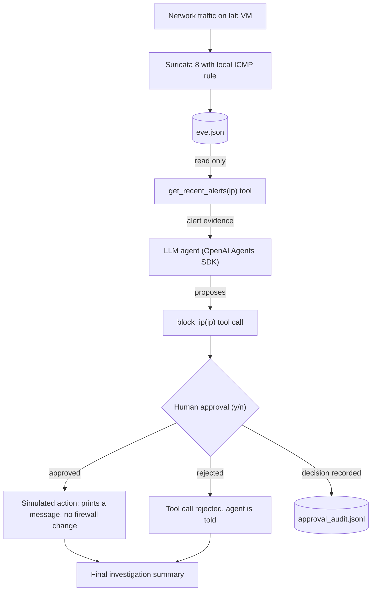
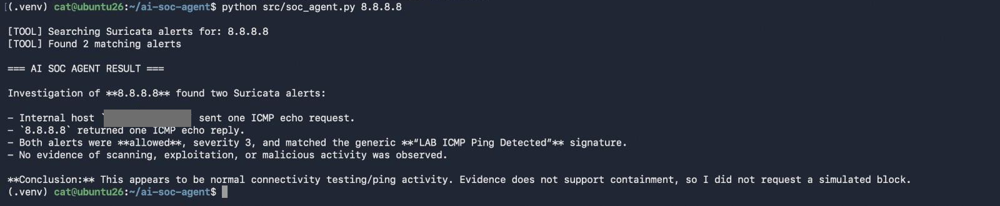
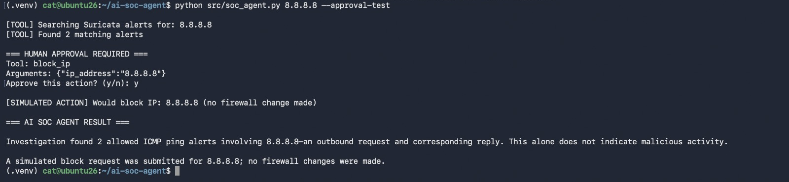

# AI SOC Agent

An AI-assisted SOC investigation agent built as a hands-on security engineering lab. It reads real Suricata alerts, lets an LLM investigate them through a read-only evidence tool, and puts a human approval gate in front of the response action.

**Status: lab project.** The response action is simulated. Nothing in this repository modifies a firewall, and this is not a production or autonomous SOC tool.

## The problem

SOC analysts spend much of their time triaging alerts that turn out to be benign. LLMs can help with that first pass, but giving a model response tools creates new risk: it can misjudge evidence, it can be manipulated by attacker-controlled data inside the telemetry it reads, and it can take actions nobody authorised.

This project explores a small, concrete version of that problem: how do you let a model investigate real telemetry and propose a response, while keeping the decision to act with a human?

## What I built

- Suricata 8 on an Ubuntu VM with a simple local ICMP rule that writes alerts to `eve.json`. It now runs continuously as a systemd service on the lab interface (`ens160`). The two alerts used in the investigation shown here were captured earlier, in a manual session.
- A Python agent (OpenAI Agents SDK) with two tools:
  - `get_recent_alerts(ip)`: read-only evidence retrieval from `eve.json`.
  - `block_ip(ip)`: a **simulated** response action that requires human approval before it runs.
- A terminal approval step that pauses the run, shows the proposed tool call, and defaults to deny.
- An append-only audit log of every approval decision.

## Architecture



## Technology stack

| Layer | Technology |
|---|---|
| Sensor | Suricata 8.0.3 on Ubuntu, systemd service capturing on `ens160` |
| Telemetry | Suricata EVE JSON (`eve.json`) |
| Agent | Python 3.14, OpenAI Agents SDK (`openai-agents` 0.22.3) |
| Model | OpenAI model, set with `OPENAI_MODEL` |
| Configuration | `python-dotenv`, environment variables |
| Tests | `unittest` (standard library), offline, no API calls |

## Suricata telemetry flow

The lab rule in [`suricata/local.rules`](suricata/local.rules) alerts on any ICMP packet:

```
alert icmp any any -> any any (msg:"LAB ICMP Ping Detected"; sid:1000001; rev:1;)
```

A single `ping` from the VM to `8.8.8.8` produces two alerts, one for the echo request and one for the reply. Suricata writes each as one JSON object per line. A trimmed example of the request alert:

```json
{
  "timestamp": "2026-09-28T13:03:53.488372+0000",
  "event_type": "alert",
  "src_ip": "192.0.2.10",
  "dest_ip": "8.8.8.8",
  "proto": "ICMP",
  "icmp_type": 8,
  "alert": {
    "action": "allowed",
    "signature_id": 1000001,
    "signature": "LAB ICMP Ping Detected",
    "severity": 3
  }
}
```

Both alerts are in [`examples/sample_eve.json`](examples/sample_eve.json). They are the real captured events with one substitution: the lab VM's private address is replaced by `192.0.2.10`, an address from the range reserved for documentation (RFC 5737). It stands for the internal host that sent the ping. `8.8.8.8` is Google Public DNS, used here only as a ping target. It is not malicious and nothing in this project treats it as such.

**Where the demonstrated alerts came from.** The two alerts investigated in this README were captured on 2026-09-28 during a manual Suricata session of about 17 minutes on the VM's `ens160` interface. At that point the systemd service was not working: the packaged configuration pointed at `eth0`, which does not exist on this VM, so the service failed at every start.

**Current state.** On 2026-10-01 I corrected the capture interface to `ens160`. Suricata now runs continuously as a systemd service and appends to the same `eve.json`. The service did not generate the two alerts above, and every investigation shown in this README used those two earlier alerts.

The agent reads the log file at rest. It does not tail a live stream.

## AI and tool-use architecture

The model never reads the log directly and never runs commands. It can only call two Python functions with one typed argument each.

| Tool | Access | Approval | What it does |
|---|---|---|---|
| `get_recent_alerts(ip_address)` | Read only | Not required | Validates the IP, scans `eve.json`, returns the true match count and the 10 most recent matching alerts |
| `block_ip(ip_address)` | None (simulated) | **Required** | Validates the IP, prints a simulated action line, returns a message stating nothing was changed |

Design points:

- Arguments are validated with Python's `ipaddress` module before use. Anything that is not a single IPv4 or IPv6 address is rejected.
- Malformed or truncated log lines are skipped and counted, not fatal.
- The agent's instructions tell it to base conclusions on evidence, to say when evidence is insufficient, and to treat alert contents as untrusted data.

## Evidence-based investigation

A triggered rule is not proof of an attack. The lab rule fires on every ping, which makes it a useful test of whether the model reasons from evidence or just echoes the alert.

In the normal investigation path, the model retrieved the two alerts, identified them as one ICMP echo request and its reply, found no evidence of scanning, exploitation or malicious activity, and did not request the simulated block.



*Normal investigation path (`python src/soc_agent.py 8.8.8.8`), run as an unprivileged user. The agent calls `get_recent_alerts`, finds two matching alerts, and concludes that the evidence does not support containment, so it does not request a block. The lab VM's private address is masked in the image.*

## Human-in-the-loop response control

`block_ip` is registered with `needs_approval=True`. When the model requests it, the SDK interrupts the run before the tool executes. The script then shows the tool name and arguments and waits for the operator.



*Approval-test path (`python src/soc_agent.py 8.8.8.8 --approval-test`), run as an unprivileged user. The run stops at the approval prompt, the operator types `y`, and only then does the simulated action run. No firewall change is made. Only the input `y` approves; anything else, including an empty line, rejects.*

Each decision is appended to `approval_audit.jsonl`:

```json
{"timestamp": "2026-10-01T17:20:37.993559+00:00", "operator": "cat", "tool": "block_ip", "arguments": "{\"ip_address\":\"8.8.8.8\"}", "decision": "approved", "simulated": true}
```

**About this test.** The `--approval-test` flag instructs the model to request `block_ip` so the approval gate can be exercised. The model did not decide on its own that `8.8.8.8` should be blocked, and its final answer says the alerts alone do not indicate malicious activity. In the normal path shown earlier, without the flag, it did not request a block. The test demonstrates that the gate holds, not that the model makes good containment decisions.

## Built and verified vs planned

### Built and verified

| Capability | How it was verified |
|---|---|
| Suricata 8 producing EVE JSON alerts from a local rule | Manual capture session on 2026-09-28; alerts present in `eve.json`, copies with the VM address replaced in `examples/sample_eve.json` |
| Suricata running as a systemd service on `ens160` | Service active and writing events to `eve.json` since 2026-10-01. No agent investigation has yet been run on alerts from the service. |
| Python parsing of `eve.json` | `examples/01_read_alert.py` run against the live log and the sample file |
| Single-alert LLM investigation | `examples/02_investigate_alert.py`, run during the build. Not re-run since its configuration handling was edited. |
| Agent retrieving evidence through a tool | Both screenshots above |
| Agent does not request a block when the evidence does not support it | Normal-path screenshot above. One benign scenario only. |
| Approval gate stops the run before the response tool executes | Approval-flow screenshot above: the simulated action appears only after the operator's `y` |
| Approved path executes the simulated action | Approval-flow screenshot above |
| Agent runs as an unprivileged user (no `sudo`) | Both screenshots show the agent launched as a normal user on 2026-10-01 |
| IP validation, tolerant log parsing, true match count, default-deny prompt, audit records | 13 offline unit tests in `tests/` |

### Planned, not built

| Item | Status |
|---|---|
| Real firewall containment | Not built. `block_ip` is a simulation. |
| Privilege separation between agent and response executor | Not built. Design is described in [SECURITY.md](SECURITY.md). |
| Filtering or allow-listing telemetry fields before they reach the model | Not built |
| Rejected-approval path tested end to end with the model | Unit-tested at the prompt level only |
| Detection scenarios beyond a single benign ping | Not built |
| Live log tailing | Not built |

## Earlier build stage

An earlier implementation sent a single Suricata alert directly to the model for analysis before tool-based evidence retrieval was introduced. That script is kept as [`examples/02_investigate_alert.py`](examples/02_investigate_alert.py).

## Security design decisions

- **The model proposes, a human decides.** The approval decision is taken in the Python run loop from terminal input. It is not a tool, so the model has no way to call it or approve its own request.
- **Default deny.** Only `y` approves. Empty input, end of input, or any other text rejects.
- **Narrow tools, typed arguments.** There is no shell tool and no free-form command argument. Each tool takes one validated IP address.
- **Read and act are separate tools.** Evidence retrieval is read-only and unapproved. Only the action tool is gated.
- **Simulation is labelled everywhere.** The tool description the model sees, the terminal output, the tool result and the audit record all state that the action is simulated.
- **No root needed.** Early lab runs used `sudo`. Later verification showed it was not needed. On this lab VM `eve.json` is world-readable, and the agent has since been run end to end as a normal user. An LLM-driven process should not run as root, and on a system where the log is restricted the right fix is group or ACL read access for the agent's user, not `sudo`.
- **Secrets stay out of the repository.** The API key lives in an untracked `.env` file. `.env.example` contains placeholders only.

The full threat model is in [SECURITY.md](SECURITY.md).

## Current limitations

- **One scenario.** Everything has been tested against two alerts from a single benign ping. There is no evidence yet of how the agent behaves on real attack traffic or on ambiguous alerts.
- **The block is simulated.** No firewall rule is created.
- **Raw telemetry reaches the model.** Alert JSON is passed to the model unfiltered. For richer alert types (HTTP, DNS, TLS) some fields are attacker-controlled, which is a prompt injection path. The instruction to treat alerts as untrusted is a weak control on its own.
- **No privilege separation.** The agent, the approval prompt and the audit log all live in one process under one user.
- **The audit log is not tamper-evident.** It is a local file writable by the same user that runs the agent. The operator name comes from the environment and is not authenticated.
- **The approval prompt shows the tool call, not the evidence.** The operator sees the action and arguments but has to scroll up for the reasoning.
- **Telemetry leaves the host.** Alert data is sent to the OpenAI API. That is acceptable for lab data and would need review for real network telemetry.
- **Lab log permissions are permissive.** A world-readable `eve.json` is convenient here and would not be appropriate on a shared system.
- **No model evaluation.** Model output varies between runs and there is no test set measuring investigation quality.
- **Whole-file scan.** Each tool call reads the full log.

## Setup

Requirements: Python 3 (developed and tested on 3.14) and an OpenAI API key. Suricata is optional if you use the sample data.

From the repository root:

```bash
python3 -m venv .venv
source .venv/bin/activate
pip install -r requirements.txt
cp .env.example .env    # then add your API key
```

Run the offline tests (no API calls, no cost):

```bash
python -m unittest discover -s tests -v
```

Run against the bundled sample alerts, without Suricata:

```bash
SURICATA_EVE_FILE=examples/sample_eve.json python src/soc_agent.py 8.8.8.8
```

Exercise the approval gate:

```bash
SURICATA_EVE_FILE=examples/sample_eve.json python src/soc_agent.py 8.8.8.8 --approval-test
```

Run against a live Suricata sensor:

1. Install Suricata and copy `suricata/local.rules` to `/etc/suricata/rules/local.rules`.
2. Make sure `rule-files` in `/etc/suricata/suricata.yaml` lists that file.
3. Find your capture interface with `ip -br link` and set it under `af-packet:` in `suricata.yaml`. The packaged default is `eth0`, which does not exist on many systems (this lab VM uses `ens160`). With the wrong name Suricata exits at startup with `failed to find interface: No such device`.
4. Check the configuration with `sudo suricata -T -c /etc/suricata/suricata.yaml`, then start Suricata, either as a service or in the foreground with `sudo suricata -c /etc/suricata/suricata.yaml -i <interface>`.
5. Generate an alert with `ping -c 1 8.8.8.8`.
6. Run `python src/soc_agent.py 8.8.8.8`.

If your user cannot read `/var/log/suricata/eve.json`, grant read access through a group or ACL. Do not run the agent with `sudo`.

| Variable | Default | Purpose |
|---|---|---|
| `OPENAI_API_KEY` | none | Required |
| `OPENAI_MODEL` | `gpt-5.6-luna` | Model used by the agent |
| `SURICATA_EVE_FILE` | `/var/log/suricata/eve.json` | Path to the EVE log |
| `APPROVAL_AUDIT_LOG` | `approval_audit.jsonl` | Where approval decisions are recorded |

## Repository layout

```
ai-soc-agent/
├── src/soc_agent.py              Agent, tools, approval loop, audit log
├── examples/
│   ├── 01_read_alert.py          Stage 1: parse eve.json
│   ├── 02_investigate_alert.py   Stage 2: single alert to the model, no tools
│   └── sample_eve.json           The two lab alerts, VM address replaced
├── suricata/local.rules          Lab detection rule
├── tests/test_soc_agent.py       Offline unit tests
├── docs/images/                  Screenshots
├── SECURITY.md                   Threat model
├── requirements.txt
└── .env.example
```

## Engineering lessons

- **Verify the minimum privilege actually required.** Early lab runs launched the agent with `sudo`. Later verification showed that `eve.json` was readable by the normal user and that the full agent could run unprivileged. Before running an AI-driven process with elevated permissions, check what access it needs and grant only that.
- **Tool descriptions are part of the prompt.** The first `block_ip` docstring said it blocked a "malicious IP address". The model reads that text, so it has to be as accurate as the code.
- **Output wording matters as much as behaviour.** The first version printed `Blocking IP` for an action that did nothing. A screenshot of that line would have told a false story.
- **Testing the gate is different from testing the judgment.** Instructing the model to request a block proves the approval boundary works. It says nothing about whether the model would ask at the right time.
- **Parse telemetry defensively.** The first version parsed every line of `eve.json` with no error handling, so a single truncated or malformed line would have stopped the evidence tool. Suricata appends to that file while the agent reads it. The parser now skips and counts lines it cannot read, and unit tests cover that case.
- **Read the service logs, not just the status.** The original telemetry was captured successfully by running Suricata manually on `ens160`. Later inspection showed that the systemd service itself had been failing, because the packaged `af-packet` configuration still referenced `eth0`. The service logs identified the mismatch, and changing the service interface to `ens160` fixed it.
- **A noisy rule is a good first test.** A rule that fires on every ping makes it obvious whether the model is reasoning from evidence or repeating the alert name.

## Roadmap

1. Privilege separation: an unprivileged agent with read-only telemetry access and a separate, narrow, privileged response executor.
2. Real containment in an isolated lab, using validated structured arguments and fixed command templates. Never model-generated shell commands.
3. Field allow-listing so only the telemetry the model needs is sent to it.
4. More detection scenarios: port scans, known-bad signatures from a public ruleset, and ambiguous cases.
5. Show the supporting evidence inside the approval prompt.
6. Tamper-evident audit logging, written by a component the agent cannot modify.
7. A small evaluation set to measure investigation quality across runs.

## License

[MIT](LICENSE)
